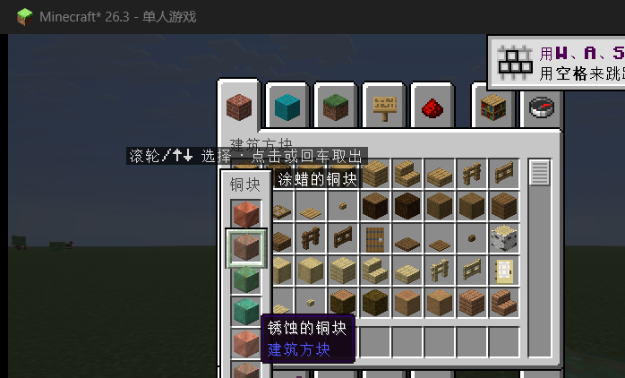

# Block_zip

把方块变种聚合成一个「方块集合」的 Fabric 客户端模组，适用于 **Minecraft 26.3**。

选中一个方块时按 **波浪键 `` ` ``**，它旁边就会**竖向**展开这个方块的全部变种：
半砖、楼梯，以及随时间变化的状态（铜的斑驳 / 锈蚀 / 氧化，以及打蜡与否）。
滚轮切换，松开按键取出，找方块不用再翻半天物品栏。

折叠栏用的是**原版物品栏那套外观**（原版槽位贴图 `container/slot`、原版容器面板配色、
原版悬停高亮），并且**直接长在你选中的那个格子上方**，和方块集合是同一条竖线。
选中格还会套上**原版快捷栏那个加粗外框**（`hud/hotbar_selection`，就是滚轮切快捷栏时
会跳到新格子上的那圈亮边），并在切换的瞬间亮一下再淡出。



## 兼容性

* **Fabulously Optimized 26.3 整合包实测通过**：连同 Sodium、Iris、ImmediatelyFast、MoreCulling、
  EntityCulling、Continuity、ModernFix、FerriteCore、Lithium、OptiGUI 等共 122 个 mod 一起加载，
  无 Mixin 冲突、无崩溃，面板与滚轮选择都正常。
* 实测方式有两种，都是真机跑出来的：
  1. 开发环境里把那套 FO mod 全部加载（124 个 mod），用自检脚本跑完整流程；
  2. **在 HMCL 启动的真实 FO 实例里手工验证**：按住 `` ` `` 展开「铜格栅」集合 →
     滚轮从「铜格栅」切到「斑驳的铜格栅」「锈蚀的铜格栅」→ 松开按键，快捷栏里的方块
     真的换成了「锈蚀的铜格栅」。
* 纯客户端模组，**只依赖 Fabric API**，没有别的硬依赖；服务器不用装。
* 一共 4 个 Mixin，都只在必要处拦截、不改动原版逻辑：
  1. `AbstractContainerScreenAccessor`：只读 `hoveredSlot / leftPos / topPos`；
  2. `AbstractContainerScreenMixin`：面板展开期间接管容器界面的点击、滚轮与松开；
  3. `CreativeModeInventoryScreenMixin`：面板盖住创造物品栏的分类栏/滚动条时让出判定；
  4. `MouseHandlerMixin`：世界里借用一次滚轮事件。

  因此和其它 UI/渲染类 mod 的冲突概率很低（已在 122 个 mod 的 FO 整合包里实测）。


## 变种范围

按需求只收三类变种，避免列表过长：

| 类型 | 例子 |
| --- | --- |
| 本体 | 石砖、铜块、橡木木板 |
| 半砖 / 楼梯 | 石砖半砖、石砖楼梯；切制铜半砖、切制铜楼梯 |
| 随时间变化的状态 | 铜块 → 斑驳的铜块 → 锈蚀的铜块 → 氧化的铜块，以及各自的涂蜡版本 |

同一组内按「本体 → 半砖 → 楼梯 / 未氧化 → 已氧化 / 未打蜡 → 已打蜡」排序，例如：

* 石砖 → 3 个：石砖、石砖半砖、石砖楼梯
* 铜块 → 8 个：4 种氧化程度 × 打蜡/不打蜡
* 切制铜 / 切制铜楼梯 / 切制铜半砖 → 24 个：4 种氧化程度 × 2（打蜡）× 3（形态）

其它模组添加的半砖、楼梯、氧化/打蜡方块也会通过命名规则自动归组。

## 安装

1. 安装 **Fabric Loader 0.19.5 或更高**（Minecraft 26.3）。
2. 安装 **Fabric API 0.161.0+26.3 或更高**。
3. 把 `block_zip-1.0.0.jar` 放进 `.minecraft/mods/`。
4. 需要 **Java 25**（Minecraft 26.3 本身就要求 Java 25）。

这是纯客户端模组，装在客户端即可，**服务器不需要装**；在别人的服务器上也能正常用。

## 使用

**世界里和物品栏里手感完全一样：按住展开 → 滚轮选 → 松开取出。**

| 操作 | 效果 |
| --- | --- |
| 手持方块（没开界面）**按住 `` ` `` 不放** | 在快捷栏上方竖向展开这个方块的全部变种 |
| 物品栏 / 创造物品栏里鼠标指向方块，**按住 `` ` `` 不放** | 在那一格旁边竖向展开变种列表 |
| 界面里鼠标没停在格子上（或那一格没有变种） | **什么都不展开**——不会因为手上拿着一个集合就展开它 |
| 按住期间：**滚轮**（或 ↑ ↓） | 上下切换选中项，选中格套着原版快捷栏那圈加粗外框 |
| 刚展开时 | 默认框选**你手上/鼠标下那一个**（不是固定第一格），所以不滚直接松开＝原样不动 |
| 按住期间：**鼠标点某一格** | 物品**贴到鼠标上**：默认 **1 个**，按住 **Shift** 一次拿一整组（和原版创造物品栏一致）。鼠标上已有同一种时，每点一次 **+1**（Shift 补满），**绝不会减少**。任何鼠标键都可以（不同机器上报的 button 编号完全不同：实测有人的左键=1、右键=3）。全程纯本地操作，不发包，不会往世界里丢东西 |
| 按住期间：数字键 1-9、回车 | 取出该变种（创造模式进快捷栏） |
| **松开 `` ` ``** | 取出选中的变种并收起面板 |
| 松开前没滚过 | 什么都不做（不会误操作） |
| 按住期间按 Esc / 点面板外面 | 取消，不取出 |

取出的规则：

* **鼠标点面板里的某一格**：变种**贴到鼠标上**（纯客户端操作，默认 1 个、按住 Shift 拿一整组），
  之后按原版习惯放进格子即可。
* **松开 `` ` `` / 回车 / 数字键**：
  * **创造模式**：变种直接放进当前快捷栏（和原版「选取方块」一致，服务器安全）。
  * **生存模式**：把该变种与你背包里已有的那一个**对调**（走普通点击，服务器认可）。
    背包里没有这个变种时，面板里该项会变暗，点击会提示「背包里没有 xxx」。

### 改键

`选项 → 控制 → 按键绑定`，分类 **Block_zip** → **展开方块变种列表**，可以绑到任意键
（包括鼠标侧键）。

## 从源码构建

需要 JDK 25（模组与 Loom 都要求）：

```bat
set JAVA_HOME=C:\mods\tools\jdk25\jdk-25.0.4.1+1
gradlew.bat build
```

产物在 `build/libs/block_zip-1.0.0.jar`。

开发环境（本机已装好）：

* **JDK 25**：`C:\mods\tools\jdk25\jdk-25.0.4.1+1`（Temurin 25.0.4.1）
* **IntelliJ IDEA Community 2025.2.6.2**：`C:\Program Files\JetBrains\IntelliJ IDEA Community Edition 2025.2.6.2`
* IDEA 插件（已装入用户目录）：**Minecraft Development 2025.2-1.8.17**、**Ravel Remapper 0.6.4**
* Gradle **9.7.1** + Fabric Loom **1.18.2**，Minecraft **26.3**，Fabric Loader **0.19.5**，Fabric API **0.161.0+26.3**

用 IDEA 打开 `C:\mods\Block_zip`，等 Gradle 同步完成，然后运行 `Tasks → fabric → runClient`。

### 诊断

两个自检工具，平时都不会跑：

```bat
:: 无界面自检：直接起注册表，把变种分组结果打印出来（不需要开游戏）
gradlew.bat variantReport

:: 进游戏自检：设了环境变量后，进入世界会自动打印分组结果并展开一次面板
set BLOCKZIP_SELFTEST=1
gradlew.bat runClient
```

`variantReport` 的期望输出：石砖 3、石头 3、橡木木板 3、铜块 8、切制铜（及楼梯/半砖）24、
铜格栅 8、泥土 0；总共 119 组。

## 26.3 上的实现要点

Minecraft 26.x 的客户端 API 与 1.21 时代差别很大，这个模组按新 API 写：

* 26.1 起官方代码不再混淆，Fabric 也改用 **Mojang 官方映射**（不再有 Yarn）。
* 界面渲染改成「提取渲染状态」：`GuiGraphicsExtractor` + `Screen#extractRenderState`，
  本模组用 Fabric 的 `ScreenEvents.afterForeground` 画面板，用一个 `@Accessor` Mixin
  读取 `hoveredSlot / leftPos / topPos`，不改动任何原版逻辑。
* 输入层换成了 SDL：`net.minecraft.client.input.KeyEvent`，键值用 `InputConstants.KEY_*`
  （`InputConstants.Type.KEYBOARD`）；世界里没有界面时用 `InputConstants.isKeyDown` 轮询方向键。
* **容器的鼠标事件不能用 Fabric 的 `ScreenMouseEvents`**：`allowMouseClick` 取消掉的只是
  `super.mouseClicked` 的返回值，`AbstractContainerScreen` 会继续处理这次点击（面板看起来"透明"、
  点击穿到下面的格子）；而 `mouseScrolled` 更彻底——`AbstractContainerScreen` 根本不调用 super，
  那个事件在背包界面里永远不触发。所以点击与滚轮改成自己 Mixin 到
  `AbstractContainerScreen#mouseClicked / #mouseScrolled` 的 HEAD 并 `setReturnValue(true)`。
* **取物只用本地 `setCarried`，绝不发 `slotNum < 0` 的包**：创造模式「把东西拿到鼠标上」
  在原版 `CreativeModeInventoryScreen` 里就只是本地 `menu.setCarried(...)`，**不发任何包**；
  而 `MultiPlayerGameMode#handleCreativeModeItemDrop` **名字里的 Drop 是真的 Drop** ——
  它发的 `ServerboundSetCreativeModeSlotPacket(-1, stack)` 会被服务端
  `ServerGamePacketListenerImpl#handleSetCreativeModeSlot` 当成 `player.drop(...)`
  **直接把物品丢到世界里**。本模组点面板里的变种 = 纯本地 `setCarried`（默认 1 个、
  按住 Shift 拿一整组），所以既不会往世界里丢东西，也不受各机器不同的鼠标键编号影响
  （实测有人的左键上报 `button=1`、右键上报 `button=3`，按编号区分必然出 bug）。
* **点选必须连「松开鼠标」一起拦**：原版 `AbstractContainerScreen#mouseReleased` 一看到
  鼠标上拿着东西，就会 `slotClicked(..., PICKUP)` 把它放回光标下的格子（点在界面外更是
  直接丢到世界里）。所以面板吃掉某次按下之后，紧跟着的那次松开也一并吃掉
  （`swallowNextRelease`），物品才真正「拿得住」。
* **创造物品栏的分类栏会抢在 super 之前**：`CreativeModeInventoryScreen#mouseClicked`
  在调用 `super` 前就 `checkTabClicked(...)` 并 `return true`，面板长高盖住分类栏时点击
  就变成「点到了分类栏」。`CreativeModeInventoryScreenMixin` 让这两个判定在面板范围内
  直接返回 false，事件才会落到面板上。
* **长按要自己过滤自动重复**：原版 `KeyboardHandler` 对每一次 keydown（含系统自动重复）都会
  `KeyMapping.click()`，而 `consumeClick()` 会把它们逐个取出来。如果每个都当一次"按下"处理，
  长按波浪键就会开→关→开→关地闪。本模组改成**边沿触发**：世界里比较 `isDown()` 的上升沿，
  界面里用 `openKeyHeld` 标记配合 `ScreenKeyboardEvents.allowKeyRelease` 复位。

## 目录结构

```
src/client/java/com/blockzip/client/
├── BlockZipClient.java              入口：按键、界面事件、HUD 挂载
├── ui/VariantPanel.java             竖向面板：布局、绘制、输入、取出
├── variant/VariantIndex.java        变种集合索引（并查集归组）
├── mixin/
│   ├── AbstractContainerScreenAccessor.java    只读原版字段（hoveredSlot / leftPos / topPos）
│   ├── AbstractContainerScreenMixin.java       接管容器界面的点击 / 滚轮 / 松开
│   ├── CreativeModeInventoryScreenMixin.java   面板盖住分类栏、滚动条时让出判定
│   └── MouseHandlerMixin.java                  世界里借用滚轮事件
└── debug/SelfTest.java              环境变量开关的自检
```

## 授权

MIT。
